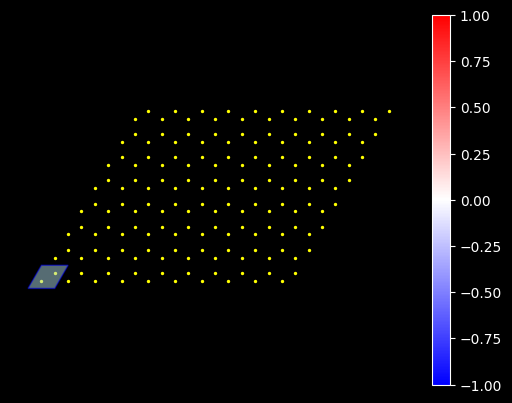
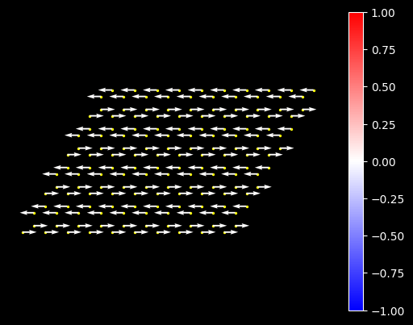
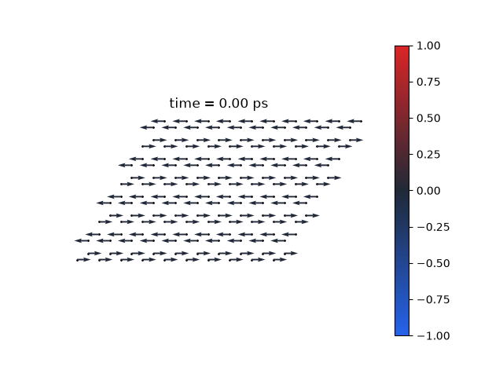

# LLGS Simulation

This repository provides a framework for simulating and analyzing spin dynamics using the Landau-Lifshitz-Gilbert-Slonczewski (LLGS) equation on 2D lattice. Supports antiferromagnetism and spin orbit torque.

## Install

LLGS Simulation requires Python 3.9 or newer. Install it directly from
[GitHub](https://github.com/ianchung621/LLGS-simulation):

```bash
python -m venv .venv
source .venv/bin/activate
python -m pip install git+https://github.com/ianchung621/LLGS-simulation.git
```

## Example Usage

Below is a step-by-step demonstration of how to use the repository to simulate spin dynamics and visualize the results.

### 1. Creating a Lattice Object

The `lattice.py` module allows you to define a spin lattice. Here's an example of creating a hexagonal lattice:

```python
from llgs import Lattice_2D

honeycomb = Lattice_2D(
    n_a = 10, n_b = 8, n_site = 2,
    r_a = [np.sqrt(3), 0], # basis vector in a-axis
    r_b = [0.5*np.sqrt(3), 1.5], # basis vector in b-axis
    r_site = [
    [1/3, 1/3], # fractional coordinates of first site
    [2/3, 2/3] # fractional coordinates of second site
    ]
)
honeycomb.plot(draw_unitcell=True)
```



### 2. Initializing Spins

Initialize the spins on the lattice to a desired configuration:

```python
ZigZag_config = {"b % 2 == 0": np.array([1,0,0]),
                "b % 2 == 1": np.array([-1,0,0])}
honeycomb.initialize_spin(ZigZag_config)
honeycomb.plot()
```



### 3. Setting Up Parameters for Simulation

Define the simulation parameters such as Gilbert damping coefficient and external magnetic field:

```python
from llgs import LLGS_Simulation_2D
from param.NiPS3 import NiPS3_params

sim = LLGS_Simulation_2D(
    honeycomb,
    H_E = H_E, # exchange field, unit: Tesla
    H_ext = H_ext, # external magnetic field, unit: Tesla
    alpha = 0.1, # Gilbert damping coefficient
    H_para = NiPS3_params['H_para'], # in-plane anisotropy, unit: Tesla
    H_perp = NiPS3_params['H_perp'], # out-of-plane anisotropy, unit: Tesla
    io_foldername = "Data/NiPS3", # folder to save data
    io_filename = "results_RK4", # the data file name
    method = "RK4" # support Euler, RK2, RK4
)
```

`H_E` may be a dense `(N, N)` array or a SciPy sparse matrix. For sparse DMI,
pass `H_DMI` as a sequence of three sparse `(N, N)` matrices, one for each
Cartesian component. Dense DMI remains a `(3, N, N)` array. Use
`matrix_type="sparse"` to convert both fields to CSR matrices,
`matrix_type="dense"` to convert them to NumPy arrays, or the default
`matrix_type="auto"` to preserve the supplied representation.

### 4. Running the Simulation

Run the simulation for a specified number of steps and save the results:

```
sim.evolve(dt = 2e-4, # time step, unit: ps
           max_iters = 50000)
```

### 5. Visualizing Spin Dynamics

The `read_result.py` module reads the simulation results and creates visualizations. Here is how you can animate the spin dynamics:

```python
from llgs import ReadResult

# Read the results from the HDF5 file
results = ReadResult(f'Data/NiPS3/results_RK4.h5')

# Create an animation of spin dynamics and save to gif or mp4
results.animate(period=50, save_fn='Data/NiPS3/movie.gif')
```

### Example Output

Here is an example of how the animation might look:



### Additional Details

For a comprehensive explanation of the methods, equations, and parameters used, please refer to the accompanying Jupyter Notebook: [example.ipynb](./example.ipynb).

This notebook includes:
- Detailed descriptions of lattice construction.
- Explanation of the exchange field matrix and LLGS simulation.
- Mathematical derivations and parameter setups.
