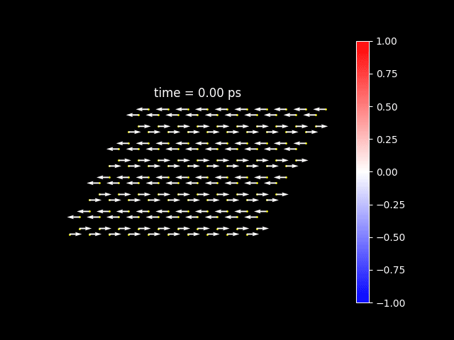

# LLGS Simulation

This repository provides a framework for simulating and analyzing spin dynamics using the Landau-Lifshitz-Gilbert-Slonczewski (LLGS) equation. The repository includes the following core modules:

1. **`lattice.py`**: Creates a lattice object representing the spin configuration.
2. **`LLGS_simulation.py`**: Performs the LLGS simulation and stores the results in an HDF5 file.
3. **`read_result.py`**: Reads the HDF5 file and creates visualizations, including animations of spin dynamics.

## Example Usage

Below is a step-by-step demonstration of how to use the repository to simulate spin dynamics and visualize the results.

### 1. Creating a Lattice Object

The `lattice.py` module allows you to define a spin lattice. Here's an example of creating a hexagonal lattice:

```python
from core.lattice import lattice_2D

honeycomb = lattice_2D(n_a = 10, n_b = 8, n_site = 2) # 10 unit-cell on a-axis, 8 on b-axis, each unit cell contains 2 sites

honeycomb.set_position(
    r_a = np.array([np.sqrt(3), 0]), # basis vector in a-axis
    r_b = np.array([0.5*np.sqrt(3), 1.5]), # basis vector in b-axis
    r_site = np.array((
    [0.5*np.sqrt(3), 0.5], # location in unit-cell for first site
    [np.sqrt(3), 1] # location in unit-cell for second site
    ))
)
honeycomb.plot(draw_unitcell=True)
```


### 2. Initializing Spins

Initialize the spins on the lattice to a desired configuration:

```python
ZigZag_config = {"b % 2 == 0": np.array([1,0,0]),
                "b % 2 == 1": np.array([-1,0,0])}
honeycomb.initialize_spin(ZigZag_config)
honeycomb.plot()
```


### 3. Setting Up Parameters for Simulation

Define the simulation parameters such as Gilbert damping coefficient and external magnetic field:

```python
from core.LLGS_simulation import LLGS_Simulation_2D

sim = LLGS_Simulation_2D(honeycomb)
sim.set_exchange_field(H_E = H_E) # exchange field
sim.set_H_ext(H_ext = H_ext) # external magnetic field
sim.setup(alpha = 0.1, # Gilbert damping coefficient
          H_para = NiPS3_params['H_para'], # in-plane anisotropy
          H_perp = NiPS3_params['H_perp'], # out-of-plane anisotropy 
          io_foldername = "Data/NiPS3", # folder to save data
          io_filename = "results_RK4", # the data file name
          method = "RK4" # support Euler, RK2, RK4
          )
```

### 4. Running the Simulation

Run the simulation for a specified number of steps and save the results:

```
sim.evolve(honeycomb, 
           dt = 2e-4, 
           max_iters = 50000)
```

### 5. Visualizing Spin Dynamics

The `read_result.py` module reads the simulation results and creates visualizations. Here is how you can animate the spin dynamics:

```python
from core.read_results import ReadResult

# Read the results from the HDF5 file
results = ReadResult(f'Data/NiPS3/results_RK4.h5')

# Create an animation of spin dynamics and save to gif or mp4
results.animate(save_fn = f'Data/NiPS3/movie.gif') 
```

### Example Output

Here is an example of how the animation might look:



### Additional Details

For a comprehensive explanation of the methods, equations, and parameters used, please refer to the accompanying Jupyter Notebook: [example.ipynb](./example.ipynb).

This notebook includes:
- Detailed descriptions of lattice construction.
- Explanation of the exchange field matrix and LLGS simulation.
- Mathematical derivations and parameter setups.
